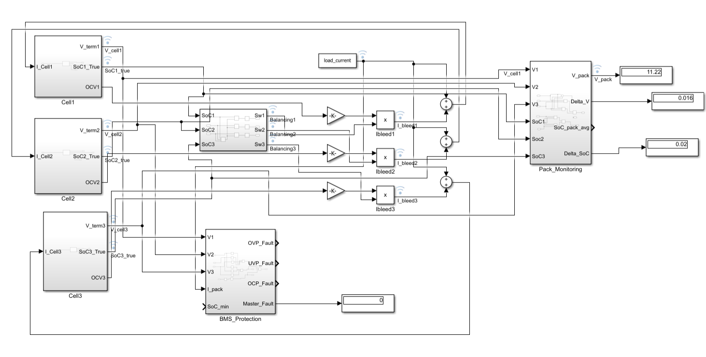
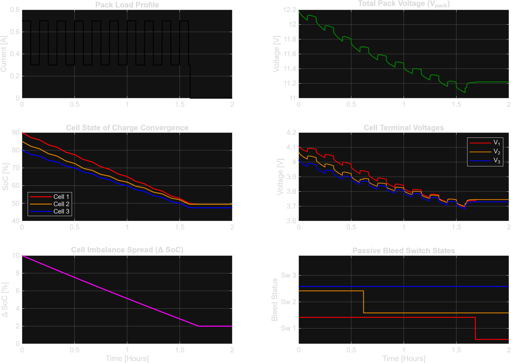

# 3S1P Lithium-Ion Battery Management System (BMS) in Simulink

A Model-Based Design (MBD) implementation of a 3-series, 1-parallel (3S1P) Li-ion Battery Management System. This project includes 1st-order Thevenin equivalent circuit cell modeling (ECM), closed-loop hysteresis passive cell balancing, fault protection logic, and telemetry monitoring under dynamic pulsing load profiles.

---

## 1. System Architecture & Plant Modeling

The battery pack plant models three series NMC cells with individual electrical dynamics:
* **Nominal Capacity ($Q_{\text{nom}}$):** 2.5 Ah
* **Equivalent Circuit Model:** 1st-Order Thevenin ($R_0 = 50\text{ m}\Omega$, $R_1 = 20\text{ m}\Omega$, $C_1 = 3000\text{ F}$, $\tau = 60\text{ s}$)
* **State of Charge (SoC):** Coulomb counting integration coupled with non-linear $V_{\text{OCV}}(\text{SoC})$ mapping.
* **Algebraic Loop Elimination:** Bleed shunts are decoupled from instantaneous terminal voltage $V_{\text{term}}$ and referenced to the internal state-driven Open-Circuit Voltage ($\text{OCV}$).
---

## 2. Passive Balancing & Supervisory Logic

* **Topology:** Switched dissipative shunt resistors ($R_{\text{bleed}} = 33\ \Omega$, $I_{\text{bleed}} \approx 120\text{ mA}$).
* **Balancing Strategy:** Cell-to-minimum hysteresis comparator. Balancing activates when $SoC_i - SoC_{\min} \ge 3\%$ and disengages when $SoC_i - SoC_{\min} \le 2\%$, eliminating relay chatter.
* **Safety Thresholds:**
  * Over-Voltage Protection (OVP): $4.25\text{ V}$
  * Under-Voltage Protection (UVP): $2.80\text{ V}$
  * Over-Current Protection (OCP): $3.00\text{ A}$

---

## 3. Simulation Results & Verification Metrics

Simulated using a fixed-step Runge-Kutta solver (`ode4`, step size $\Delta t = 0.1\text{ s}$) over a 7200-second (2-hour) dynamic pulse profile[cite: 4].

| Performance Metric | Numerical Result | System Implication |
| :--- | :--- | :--- |
| **Initial SoC Spread ($\Delta\text{SoC}_0$)** | **10.00%** | Cells initialized at 90%, 85%, 80%[cite: 4] |
| **Final SoC Spread ($\Delta\text{SoC}_f$)** | **2.00%** | Locked at lower hysteresis boundary[cite: 4] |
| **Imbalance Reduction** | **80.0%** | Closed-loop convergence achieved[cite: 4] |
| **Total Energy Dissipated** | **1.087 Wh** | Thermal budget for shunt heatsink sizing[cite: 4] |
| **Fault Flag States** | **0 (No Fault)** | Compliant across entire operating envelope[cite: 1] |
### Simscape / Simulink System Model




---

## 4. How to Run

1. Open MATLAB and ensure all subfolders are added to the path (`addpath(genpath(pwd))`).
2. Initialize parameters:
   ```matlab
   run('scripts/BMS_init.m')
